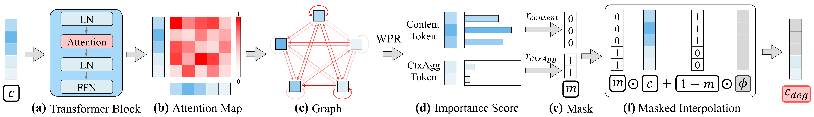

# 基于语义退化条件引导扩散模型

**[CVPR 2026] 官方实现**

[English](README.md) | **中文**

[](https://arxiv.org/abs/XXXX.XXXXX) [](LICENSE)




## 摘要

无分类器引导（CFG）是现代文本到图像模型的基石，但其对语义空洞的空提示的依赖会产生易发生几何纠缠的引导信号。这是限制其精度的关键因素，导致了在复杂组合任务中广泛记录的失败案例。我们提出了**条件退化引导（Condition-Degradation Guidance, CDG）**，一种用策略性退化的条件替代空提示的新范式。这将引导从粗略的"好 vs. 空"对比重构为更精细的"好 vs. 几乎好"辨别，从而迫使模型捕获细粒度的语义区分。我们发现 transformer 文本编码器中的 token 分为两种功能角色：编码对象语义的内容 token 和捕获全局上下文的上下文聚合 token。通过选择性地仅降级前者——我们称之为**分层退化**——CDG 无需外部模型或训练即可构建退化条件。在包括 Stable Diffusion 3、SD3.5、FLUX 和 Qwen-Image 在内的多种架构上的验证表明，CDG 显著提高了组合准确性和文本-图像对齐。作为轻量级的即插即用模块，它以可忽略的计算开销实现了这一点。我们的工作挑战了对静态、信息稀疏的负样本的依赖，并为扩散引导建立了一个新原则：构建自适应、语义感知的负样本对于实现精确的语义控制至关重要。

## 亮点

- 我们揭示了 transformer 文本编码器中**内容 token**（编码对象特定语义）与**上下文聚合 token**（编码全局组合上下文）之间的功能二分法，并提出**分层退化**作为构建语义退化负条件的原则性策略。
- 我们将这一原则实例化为 **Condition-Degradation Guidance (CDG)**，一个轻量级、无需训练的即插即用模块，不需要外部模型或额外训练。
- 我们在多种模型（SD3、SD3.5、FLUX.1-dev、Qwen-Image）上验证了 CDG，提供了卓越信号正交性的几何证据，并展示了以可忽略开销实现的一致性指标提升。

## 快速开始

只需 3 步即可开始使用 CDG：

### 1. 安装依赖

创建 conda 环境并安装必需的包：

```bash
conda create -n cdg python=3.10
conda activate cdg

# 安装系统依赖
conda install ffmpeg=6.1.2 -c conda-forge

# 安装 PyTorch（支持 CUDA 12.1）（重要：必须包含 torchaudio）
pip install torch torchvision torchaudio --index-url https://download.pytorch.org/whl/cu121

# 安装其他依赖
pip install diffusers transformers pillow numpy pandas tqdm matplotlib \
    torchmetrics torch-fidelity hpsv2 aesthetic-predictor-v2-5 t2v-metrics accelerate
```

> **注意**：
> - ffmpeg 是 t2v-metrics（VQAScore 评测）所必需的
> - torchaudio 必须从同一 PyTorch 索引安装以确保 CUDA 兼容性
> - 如果遇到网络问题，请参考评测配置文档中的故障排除章节

### 2. 下载 SD3 模型

从 Hugging Face 下载 Stable Diffusion 3 Medium：
- 模型：[stabilityai/stable-diffusion-3-medium](https://huggingface.co/stabilityai/stable-diffusion-3-medium)

下载的模型应包含以下文件：
- `config.json`
- `model.safetensors` 或 `pytorch_model.bin`
- 其他配置文件

更新 `configs/models/models_path.json` 中的路径：

```json
{
    "sd3": "path/to/your/stable-diffusion-3-medium"
}
```

> **重要**：使用包含 `config.json` 的目录的绝对路径。

### 3. 运行 CDG

使用 CDG 生成你的第一张图像：

```bash
CUDA_VISIBLE_DEVICES=0 python models/runner/cdg/sd3.py
```

生成的图像将保存在 `outputs/` 目录中。

---

**关于详细的模型配置（SD3.5、FLUX、Qwen-Image）以及与其他方法（CFG、CADS、ICG、SEG、PAG、SFG、DNP）的对比，请参见下面的[环境配置](#环境配置)部分。**

## 环境配置

### 1. 环境安装

使用 Python 3.10 创建 conda 环境并安装依赖：

```bash
conda create -n cdg python=3.10
conda activate cdg

# 安装系统依赖
conda install ffmpeg=6.1.2 -c conda-forge

# 安装 PyTorch（支持 CUDA 12.1）（重要：必须包含 torchaudio）
pip install torch torchvision torchaudio --index-url https://download.pytorch.org/whl/cu121

# 安装其他依赖
pip install diffusers transformers pillow numpy pandas tqdm matplotlib \
    torchmetrics torch-fidelity hpsv2 aesthetic-predictor-v2-5 t2v-metrics accelerate
```

**重要说明**：
- **系统依赖**：ffmpeg 是 t2v-metrics（VQAScore 评测）所必需的。请按上述方式通过 conda 安装。
- **PyTorch 安装**：torch、torchvision 和 torchaudio 需要从相同的 CUDA 索引（cu121）安装以避免兼容性问题。
- **硬件要求**：建议使用至少 40GB 显存的 GPU 以获得最佳性能。

### 2. 模型与数据集

#### 必需模型

配置文件中使用占位符路径（`path/to/your/...`），请根据需要下载并更新 `configs/models/models_path.json`：

**基础模型：**
从 Hugging Face 下载以下模型：

| 模型 | 类型 | 链接 | 状态 |
|------|------|------|------|
| Stable Diffusion 3 Medium | Text-to-Image | [stabilityai/stable-diffusion-3-medium](https://huggingface.co/stabilityai/stable-diffusion-3-medium) | 必需 |
| Stable Diffusion 3.5 Large | Text-to-Image | [stabilityai/stable-diffusion-3.5-large](https://huggingface.co/stabilityai/stable-diffusion-3.5-large) | 必需 |
| FLUX.1-dev | Text-to-Image | [black-forest-labs/FLUX.1-dev](https://huggingface.co/black-forest-labs/FLUX.1-dev) | 必需 |
| Qwen-Image | Text-to-Image | [Qwen/Qwen-Image](https://huggingface.co/Qwen/Qwen-Image) | 可选 |
| SD3-ControlNet-Canny | 可控生成 | [InstantX/SD3-Controlnet-Canny](https://huggingface.co/InstantX/SD3-Controlnet-Canny) | 可选 |

**辅助模型：**
- **BLIP2 模型**：[Salesforce/blip2-opt-2.7b](https://huggingface.co/Salesforce/blip2-opt-2.7b) - 用于 DNP 方法
- **Aesthetic Predictor**：`aesthetic_predictor_v2_5.pth` - 美学评分可选本地权重（未提供时自动下载）

更新 `configs/models/models_path.json`：

```json
{
    "sd3": "path/to/your/stable-diffusion-3-medium-diffusers",
    "sd35": "path/to/your/stable-diffusion-3.5-large",
    "flux": "path/to/your/FLUX.1-dev",
    "qwenimage": "path/to/your/Qwen-Image",
    "sd3_controlnet": "path/to/your/SD3-Controlnet-Canny"
}
```

**重要提示：** 配置文件中的路径均为占位符。下载模型后，请将路径修改为您的实际存储位置。类似地，`configs/evaluations/` 中的数据集路径也需要更新为您的实际路径。

### 3. 数据集

#### COCO 2017 数据集

下载 COCO 2017 验证集：
- 图像：[val2017.zip](http://images.cocodataset.org/zips/val2017.zip)
- 标注：[annotations_trainval2017.zip](http://images.cocodataset.org/annotations/annotations_trainval2017.zip)

更新 `configs/evaluations/coco2017.json` 中的路径：

```json
{
    "image_path": "path/to/your/coco2017/val2017",
    "prompt_file_path": "path/to/your/coco2017/annotations/captions_val2017.json"
}
```

#### GenAI-Bench 数据集

GenAI-Bench 提示词已包含在 `evaluation/Genai-Bench/Genai-Bench_prompts.json` 中，无需额外下载。详见 `evaluation/Genai-Bench/README.md`。

## 复现论文结果

### 评测配置

在运行实验之前，你需要配置评测指标（FID、CLIPScore、AestheticScore、VQAScore）并下载 COCO 2017 数据集。

**详细配置说明：**
- [English: Evaluation Metrics Configuration Guide](configs/evaluations/README.md)
- [中文：评测指标配置指南](configs/evaluations/README_zh.md)

配置文件包括：
- `configs/evaluations/metrics.json`：评测指标配置和模型路径
- `configs/evaluations/coco2017.json`：COCO 数据集路径

### COCO 2017 评测

运行以下实验以复现定量结果：

| 实验 | 模型/方法 | 命令 |
|------|-----------|------|
| COCO-SD3 | SD3 + CFG/CADS/ICG/CDG/SEG/PAG/DNP/SFG | `./experiment/COCO-SD3/run.sh` |
| COCO-SD3.5 | SD3.5 + CFG/CADS/ICG/CDG/PAG/SEG | `./experiment/COCO-SD3.5/run.sh` |
| COCO-Flux | FLUX + CFG/CADS/ICG/CDG | `./experiment/COCO-Flux/run.sh` |

### GenAI-Bench 评测

| 实验 | 模型/方法 | 命令 |
|------|-----------|------|
| Genai-SD3 | SD3 + CFG/CADS/ICG/CDG/SEG/PAG | `./experiment/Genai-SD3/run.sh` |
| Genai-SD3.5 | SD3.5 + CFG/CADS/ICG/CDG/SEG/PAG | `./experiment/Genai-SD3.5/run.sh` |
| Genai-Flux | FLUX + CFG/CADS/ICG/CDG | `./experiment/Genai-Flux/run.sh` |

每个实验脚本将：
1. 使用多个方法生成图像（支持分布式 GPU）
2. 使用 FID、CLIP Score、Aesthetic Score 和 VQA Score 指标进行评测
3. 将结果和对比表格保存在实验的输出目录中

**注意**：脚本默认使用 `GPUS="0"`。可以在脚本文件中修改此项以使用多个 GPU（例如 `GPUS="0,1,2"`）。

## 项目结构

```
classifier-degradation-guidance/
├── configs/               # 配置文件
│   ├── models/            # 模型路径配置
│   ├── methods/           # 方法特定参数
│   └── evaluations/       # 数据集和指标配置
├── models/                # 核心模型实现
│   ├── pipelines/         # 自定义扩散管道
│   │   ├── cdg/           # CDG 管道（我们的方法）
│   │   ├── cads/          # CADS 管道
│   │   ├── icg/           # ICG 管道
│   │   └── ...
│   └── runner/            # 每个模型的方法运行器
│       ├── cdg/           # CDG 运行器（sd3, sd35, flux, qwenimage）
│       ├── cfg/           # CFG 运行器
│       └── ...
├── evaluation/            # 评测框架
│   ├── core/              # 核心评测逻辑
│   ├── metrics/           # 指标实现（FID, CLIP, Aesthetic, VQA）
│   └── Genai-Bench/       # GenAI-Bench 数据集
├── experiment/            # 复现实验
│   ├── COCO-SD3/          # SD3 在 COCO 上的实验
│   ├── COCO-SD3.5/        # SD3.5 在 COCO 上的实验
│   ├── COCO-Flux/         # FLUX 在 COCO 上的实验
│   ├── Genai-SD3/         # SD3 在 GenAI-Bench 上的实验
│   ├── Genai-SD3.5/       # SD3.5 在 GenAI-Bench 上的实验
│   └── Genai-Flux/        # FLUX 在 GenAI-Bench 上的实验
├── figures/               # 论文图表
├── requirements.txt       # Python 依赖
├── LICENSE                # MIT 许可证
└── README.md              # 本文件
```

## 引用

如果你觉得我们的工作有用，请引用我们的论文：

```bibtex
@inproceedings{cdg2026,
  title={Guiding Diffusion Models with Semantically Degraded Conditions},
  author={[Authors]},
  booktitle={Proceedings of the IEEE/CVF Conference on Computer Vision and Pattern Recognition (CVPR)},
  year={2026}
}
```

## 致谢

我们要感谢：
- [Hugging Face Diffusers](https://github.com/huggingface/diffusers) 团队提供的优秀扩散模型库
- 基线方法（CFG、CADS、ICG、SEG、PAG、SFG、DNP）的作者们提供的启发性工作
- [COCO Dataset](https://cocodataset.org) 和 [GenAI-Bench](https://huggingface.co/datasets/TIGER-Lab/GenAI-Bench) 团队提供的评测基准

## 许可证

本项目采用 MIT 许可证 - 详见 [LICENSE](LICENSE) 文件。

**注意**：第三方组件（模型、数据集、库）受其各自许可证的约束。使用前请查阅所有依赖项的许可证。
